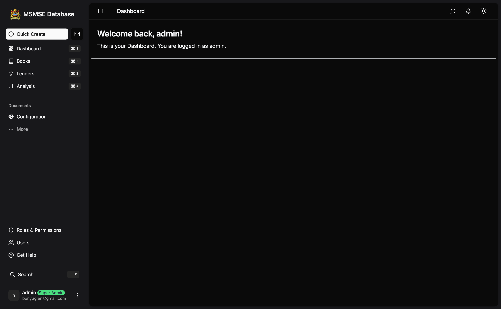
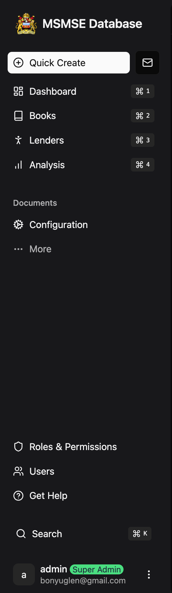
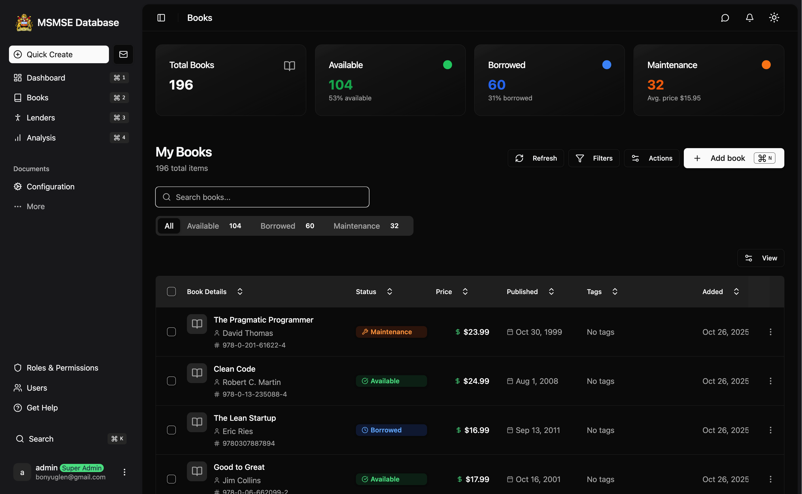
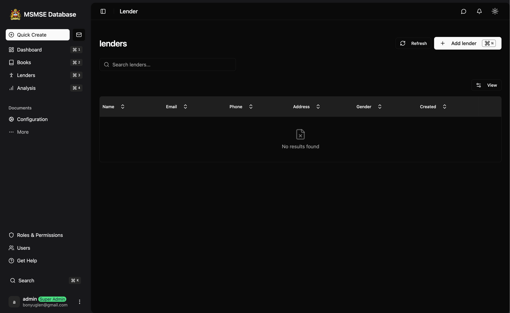
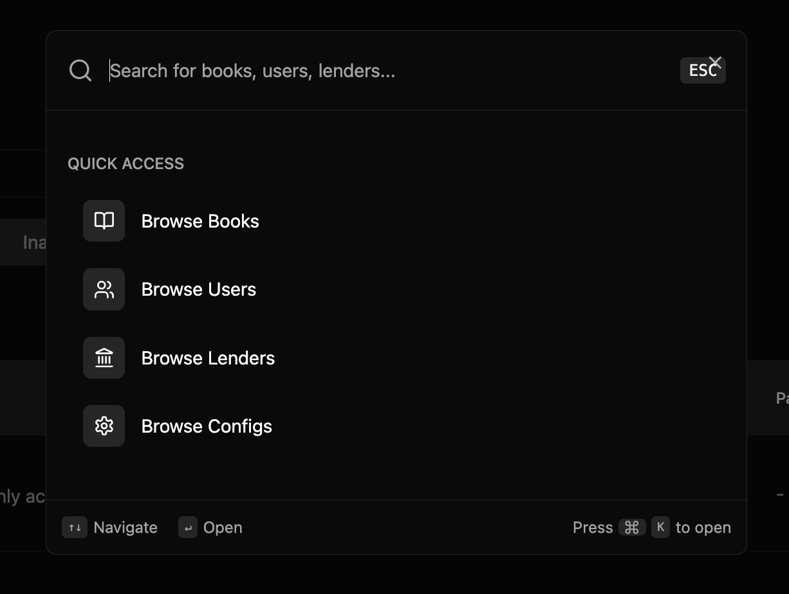
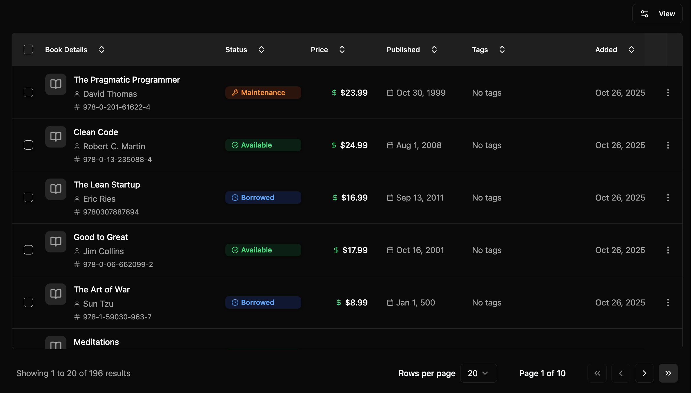
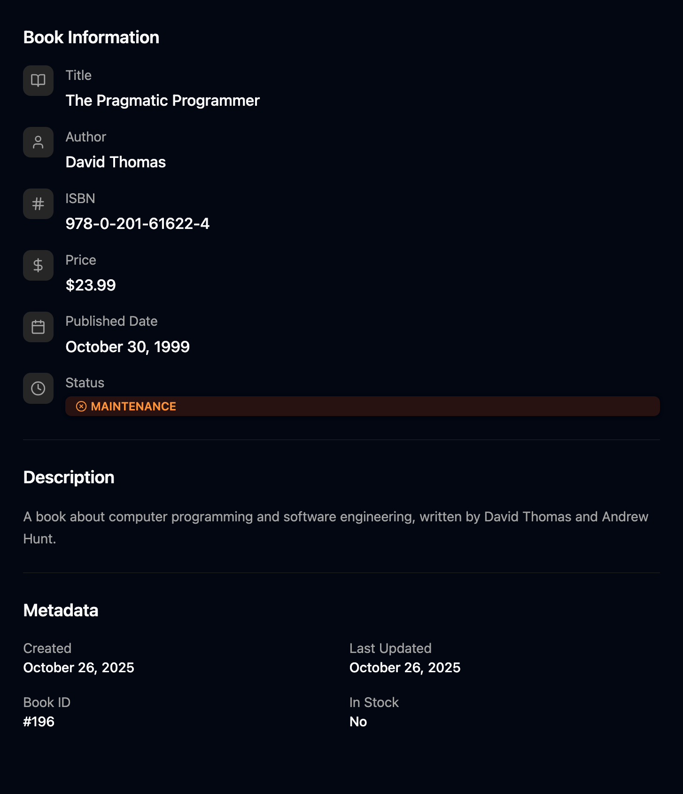
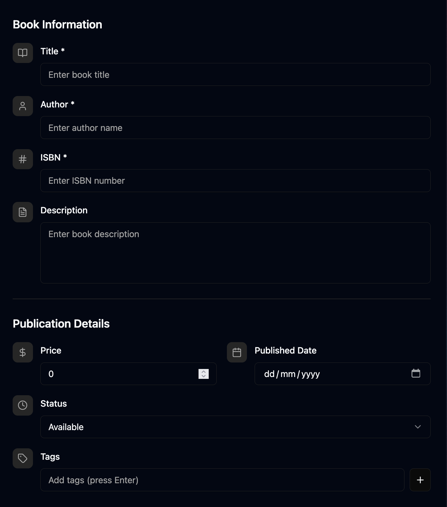

# 5. Navigation and Interface

##  Overview

The SMEDI SME Database features an intuitive, modern interface designed for efficiency and ease of use. This section covers the main navigation elements, interface components, and how to move around the system effectively.

 

### Quick Stats Cards
Located at the top of the dashboard:
- **Total SMEs**: Current number of registered SMEs
- **Active Lenders**: Number of registered financial institutions
- **New This Month**: Recently added SME records
- **Reports Generated**: Number of reports created this period

## 🧩 Main Navigation Menu


### Primary Navigation
The main menu provides access to all major system functions:

#### 📊 Dashboard
- **Overview**: System statistics and quick actions
- **My Activities**: Personal activity feed
- **Notifications**: System alerts and messages

#### 🏢 SME Management
 

- **All SMEs**: Complete list of SME records
- **Add New SME**: Create new SME registration
- **Import SMEs**: Bulk import SME data
- **SME Categories**: Manage business categories
- **Export Data**: Export SME information

#### 🏦 Lender Management
 

- **All Lenders**: List of financial institutions
- **Add New Lender**: Register new lender
- **Lender Types**: Manage lender categories
- **Loan Products**: Manage loan product offerings

#### 📈 Reports & Analytics
- **Standard Reports**: Pre-built report templates
- **Custom Reports**: Create custom analyses
- **Data Visualization**: Charts and graphs
- **Export Reports**: Download reports in various formats

#### 👥 User Management _(Admin Only)_
- **All Users**: User account management
- **Roles & Permissions**: Role assignment and configuration
- **User Activity**: Monitor user actions
- **Access Logs**: Security and audit trails

####  Administration _(Admin Only)_
 

- **System Settings**: Configure system parameters
- **Data Management**: Backup and maintenance
- **Security Settings**: Password policies and security rules
- **System Logs**: Technical system information

### Navigation Patterns

#### Hierarchical Navigation
```
Dashboard
├── SME Management
│   ├── All SMEs
│   ├── Add New SME
│   ├── Import SMEs
│   └── Categories
├── Lender Management
│   ├── All Lenders
│   ├── Add New Lender
│   └── Types
└── Reports
    ├── Standard Reports
    ├── Custom Reports
    └── Analytics
```

#### Breadcrumb Navigation
Shows your current location in the system:
- `Home > SME Management > All SMEs`
- `Home > Reports > Custom Reports > Report Builder`
- `Home > Administration > User Management > Edit User`

## 🔍 Search and Filter Interface

### Global Search
 

Located in the top header:
- **Quick Search**: Instant search across all data `command K` trigger.
- **Search Suggestions**: Auto-complete as you type
- **Recent Searches**: Quick access to previous searches
- **Advanced Search**: Detailed search criteria

### Filter Panels
Most list views include filter options:

 


## 📊 Data Display Components

### List Views
Standard format for displaying multiple records:

#### Table Layout
 


### Detail Views
Comprehensive information display for individual records:

#### Tabbed Interface
 


## Forms and Data Entry

 


#### Field Types and Interactions
- **Text Fields**: Standard text input with validation
- **Dropdowns**: Selection from predefined options
- **Date Pickers**: Calendar interface for date selection
- **File Uploads**: Drag-and-drop or browse file selection
- **Multi-select**: Choose multiple options from a list
- **Rich Text**: Formatted text editor for descriptions

### Form Validation
Real-time validation provides immediate feedback:
- **Required Fields**: Marked with asterisk (*) and validated on submit
- **Format Validation**: Email, phone number, ID number format checking
- **Range Validation**: Numeric ranges, date ranges, text length limits
- **Cross-field Validation**: Ensure related fields are consistent


## 🔔 Notifications and Alerts

### Notification Types

#### System Notifications
- **Information**: General system updates and announcements
- **Success**: Confirmation of successful operations
- **Warning**: Important notices requiring attention
- **Error**: Problems requiring immediate action

#### Personal Notifications
- **Assigned Tasks**: New assignments or responsibilities
- **Approval Requests**: Items requiring your approval
- **Data Updates**: Changes to records you're monitoring
- **System Maintenance**: Scheduled maintenance notifications

### Notification Interface
```
┌─────────────────────────────────────────────────────────┐
│ 🔔 Notifications (3)                         [Mark All Read]│
├─────────────────────────────────────────────────────────┤
│ ● New SME record requires approval              2 min ago│
│ ● Monthly report generation completed          15 min ago│
│ ○ System maintenance scheduled for tonight     1 hour ago│
└─────────────────────────────────────────────────────────┘
```

## 📱 Responsive Design

### Mobile Interface
The system adapts to different screen sizes:

#### Mobile Navigation
- **Hamburger Menu**: Collapsible main navigation
- **Bottom Navigation**: Quick access to primary functions
- **Swipe Gestures**: Swipe between tabs and screens
- **Touch Targets**: Appropriately sized for finger navigation

#### Tablet Interface
- **Sidebar Navigation**: Persistent sidebar on larger tablets
- **Split Views**: Side-by-side content on landscape orientation
- **Touch-Optimized**: Forms and controls sized for touch input
- **Gesture Support**: Pinch-to-zoom, swipe navigation

### Cross-Device Synchronization
- **Session Continuity**: Continue work across devices
- **Preference Sync**: Personal settings synchronized
- **Draft Saving**: Automatic saving of incomplete forms
- **Offline Capability**: Limited offline functionality

## 💡 Interface Tips and Tricks

### Efficiency Tips
1. **Bookmark Frequently Used Pages**: Use browser bookmarks for quick access
2. **Use Global Search**: Fastest way to find specific records
3. **Customize Dashboard**: Arrange widgets for your workflow
4. **Learn Keyboard Shortcuts**: Significantly speeds up navigation
5. **Use Filters**: Pre-set filters for common data views

### Navigation Best Practices
1. **Use Breadcrumbs**: Understand your location in the system
2. **Check Notifications**: Regular review of system notifications
3. **Save Work Frequently**: Use Ctrl+S to save form progress
4. **Use Help Context**: Click ? icons for field-specific help
5. **Log Out Properly**: Always log out when finished

---

**Previous**: [Roles and Permissions](04-roles-permissions.md) ← | **Next**: [Managing SME Records](06-sme-management.md) →
